# AzureFunctions-knowledge

## Azure Functionsとは

任意のプログラミング言語を使用してサーバレスにコーディング・実行ができるサービスのこと。AWSでのLambdaに近い立ち位置のサービスの認識。実行環境を用意せずとも、コード単体で実行できます！というサービスのイメージです。

今回の学習では、Functionsを何通りかのトリガーで実行させ、Functionsの基礎を学び、最終的には、以前作成したLogicAppsを呼び出してくれる関数の作成に挑戦してみます。


## 簡単な動作確認

まずは、期待通りに動作してくれるFunctionsの作成から行います。

今回はHTTPリクエスト受信時に処理が開始するトリガーを選択しました。

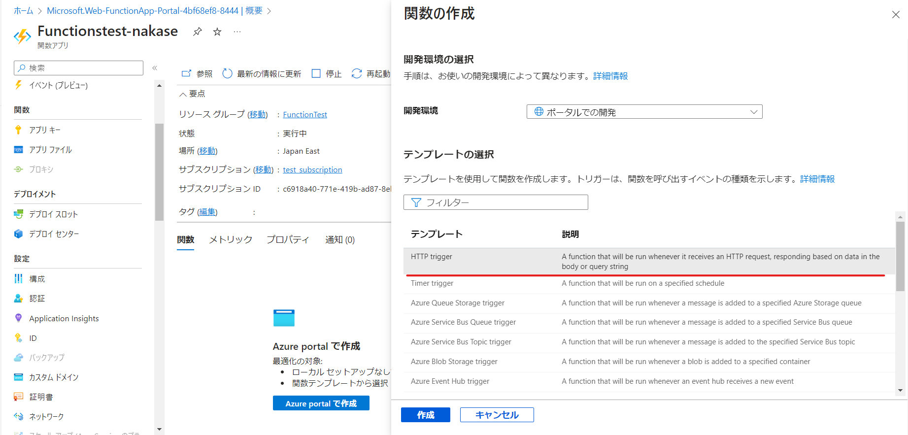

HTTPトリガーを選択した際のサンプルコードは以下の通りです。

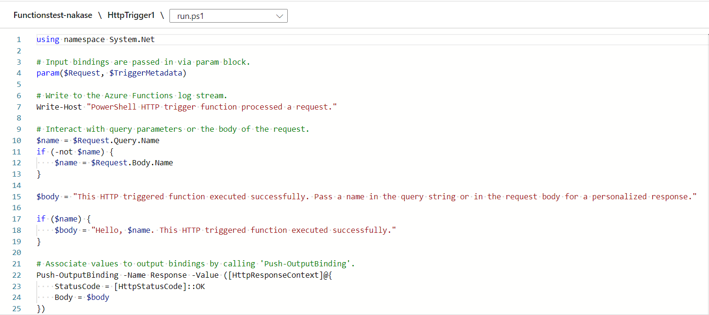

body部にnameのキーがあるかないかを判断して表示する文字列を変えるだけの簡単な処理です。

一応それぞれの出力ができることを確認します。

呼び出す際のURLは以下から取得ができるのでPOSTMANで検証してみます。

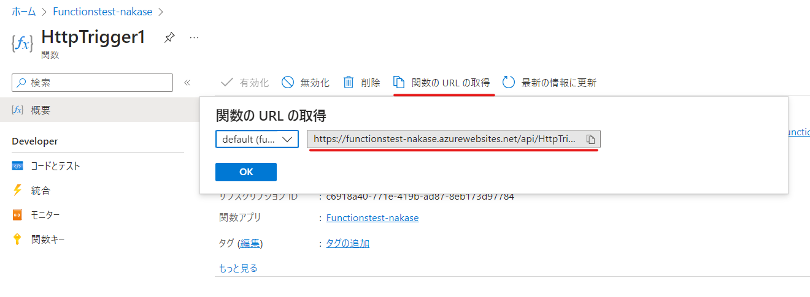

**①Body部を空にしたリクエスト**

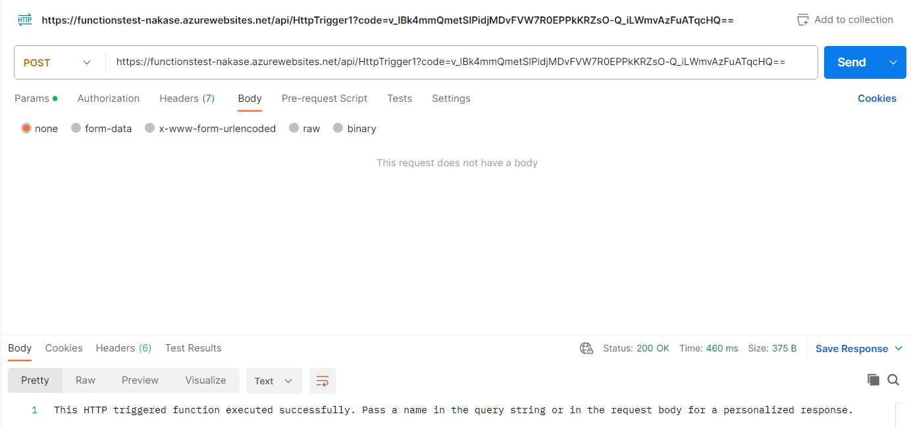

ちゃんとbody内に「name」のキーが存在しない場合の出力になっていることがわかります。

**②Body部に必要なキーを与えた場合のリクエスト**

body内容
```
{
    "name": "nakase"
}
```


ちゃんとbodyの内容を参照してくれました。

ここにInvoke-Webrequestのコマンドを用意して、LogicAppsや他のサービスのURLをパラメータで渡すことで、任意のリクエストを行うこともできそうです。

## LogicAppsとの連携

ここまでの検証でLogicApps単体の動作確認は実施できたので、これからLogicAppsも絡めた関数を作成してみます。

呼び出すLogicAppsは以下の通りです。（以前作成時は「Twitter」でしたが今は「X」になってました）

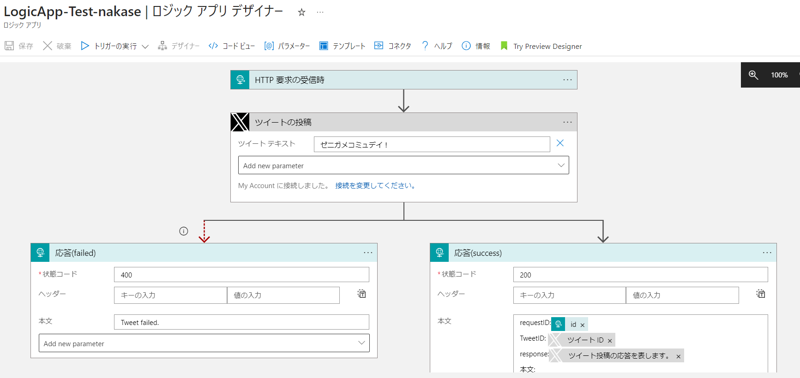

これを呼び出すためにコールバックURLを取得する必要がありますが、下記のコマンドで取得可能です。

```
Get-AzLogicAppTriggerCallbackUrl　-ResourceGroupName "LogicAppTest" -Name LogicApp-Test-nakase -TriggerName manual
```

後はリクエストを行うコマンドにコールバックURLを指定して関数は完成です。

Az-moduleをインポートしてくださいと言われてしまったので、Functions上で準備します。


修正後、再度実行してみたところ、以下のエラーが発生しました。

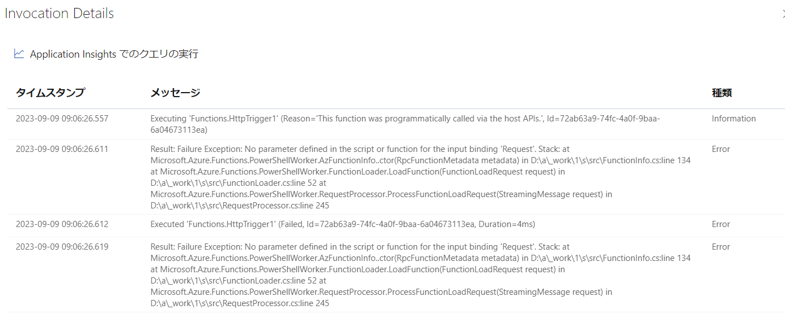

その後しばらく調査を続けましたが、入力バインドのエラーが解決できなかったため、ここでは代わりに環境変数を使用して実行してみます。

Azure Functionsでの環境変数の設定は「構成 > アプリケーション設定 > 新しいアプリケーション設定」から設定できます。今回は「LogicAppsURL」にコールバックURLを設定しました。この変数をコード上から呼び出します。


最終的なコードはこのようになりました。


パラメータはbodyから取得した値を使用して作成し、LogicAppsのURLは環境変数から取得してリクエストを送信する関数です。

実行結果をそれぞれ確認してみます。

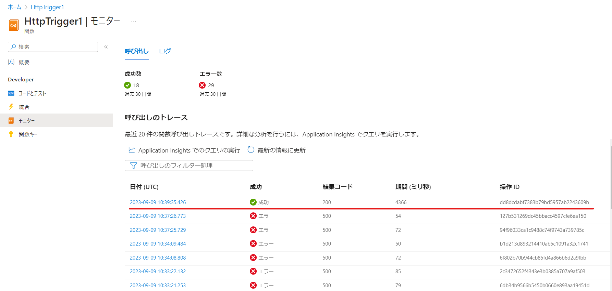

時間は多少かかっていますが、ちゃんと関数（HttpTrigger1）の実行に成功しています。

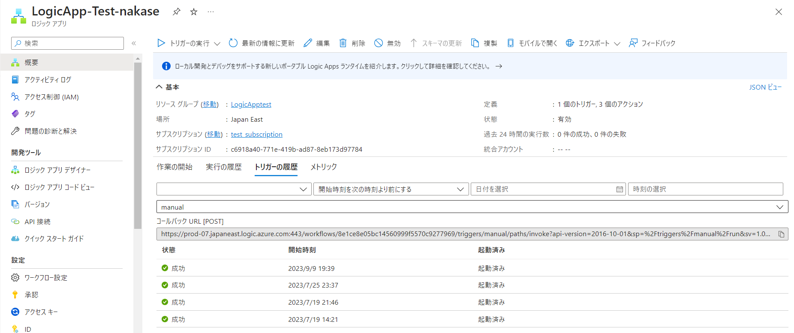

functionsから呼び出したLogicAppsもちゃんと呼び出されて処理が行われていることが確認できました。


## Queueストレージトリガーの検証

前節では、LogicAppsとの連携を検証しFunctionsが期待通りに動作することを確認できました。本節では、HTTPトリガー以外のトリガーで動作を確認します。

概要 > 関数 > 作成 から新たに関数を作成します。
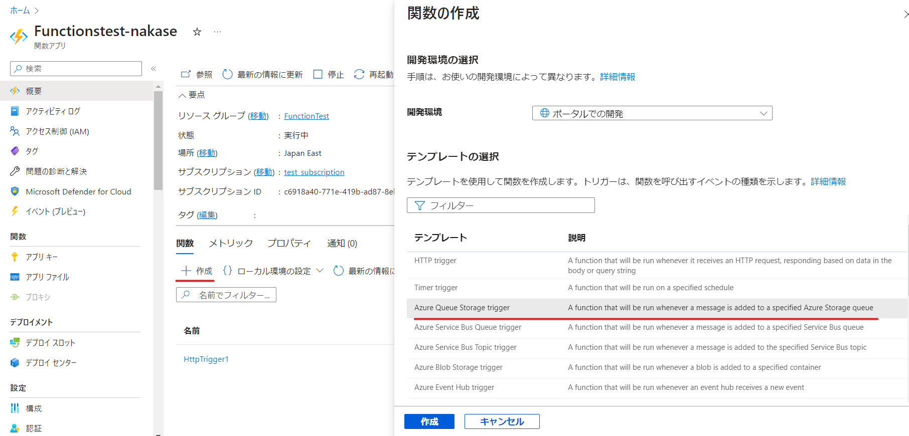


Functionsを作成する際に選択したストレージアカウントにQueueストレージを新たに作成しました。（queuetest）


このQueueストレージにメッセージが追加されるたびに、Azure Functionsで作成した関数が発火される仕組みとなっています。

ただ、このままでは今作成したばかりのQueueストレージを見てくれるはずもないので、一箇所トリガー情報の修正を行います。

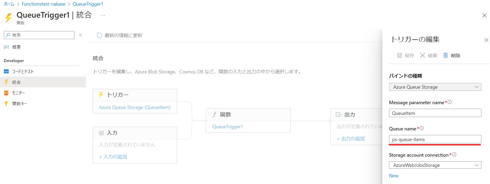

ここのQueue Nameで記載されているQueueストレージを参照する設定になっているため、「queuetest」を指定します。

本来の使用用途としては、何かしらのソリューションの実行結果がQueueストレージに格納され、それがトリガーの役割を担ってFunctionsの関数が実行...のような運用が想定されますが、今回は動作確認のため、手動でメッセージを追加して期待通りの動作が行われることをテストします。

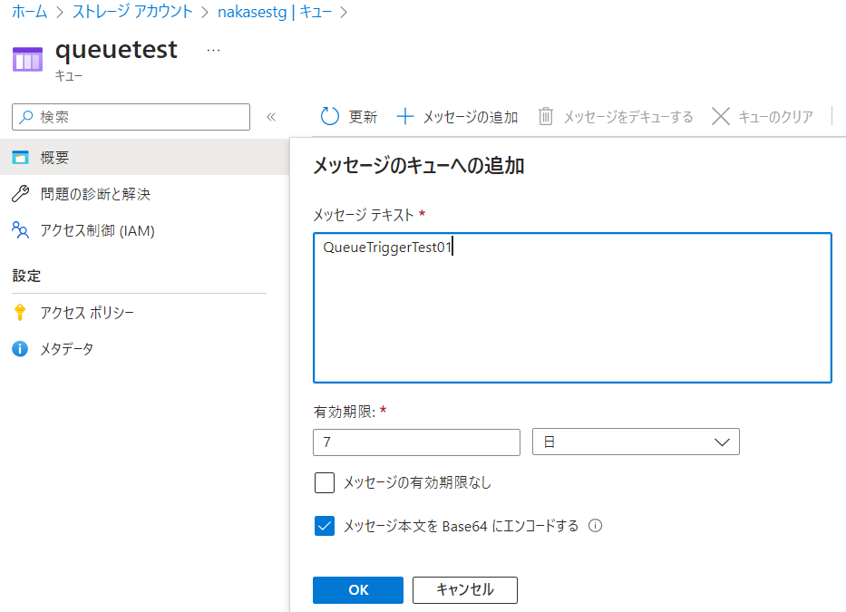

関数のログを確認したところ、ちゃんとQueueストレージのメッセージを取得することができていました。


## Queueストレージ出力の検証

Functionsの最後の学習として、Functionsの処理結果をQueueストレージに格納する関数を作成してみます。

関数は前節で作成したものを使用して、今回新たに出力の処理を追加して検証を行います。


今回実験する出力はQueueストレージですが、プルダウンには以下の様にかなり幅広く選択できるようになっていました。Azure Functionsはまだまだ奥が深そうです。

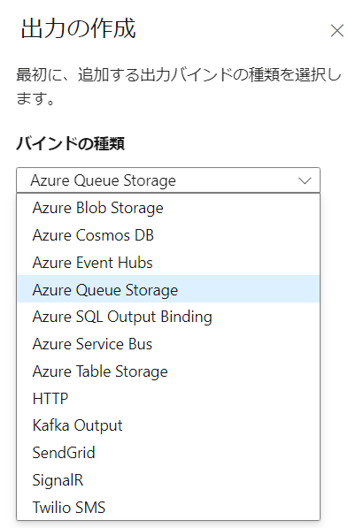

勿論、出力結果を格納するQueueストレージも用意しておきます。

これだけ用意すればきちんと動作するはずなので、早速トリガーで参照しいるQueueストレージにメッセージを追加してみます。


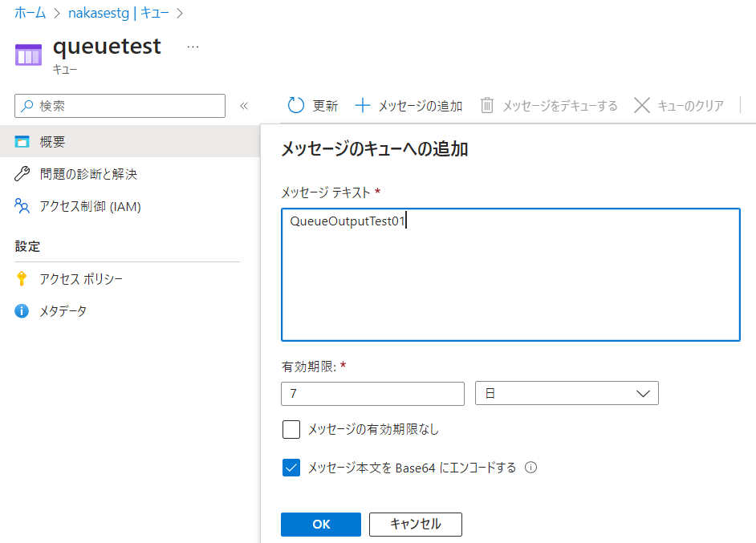


